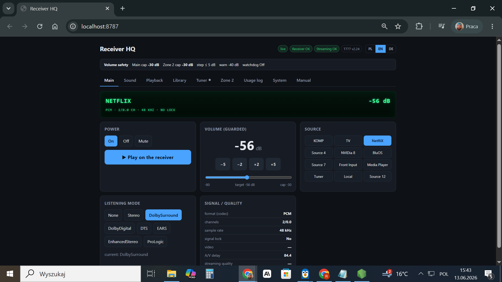
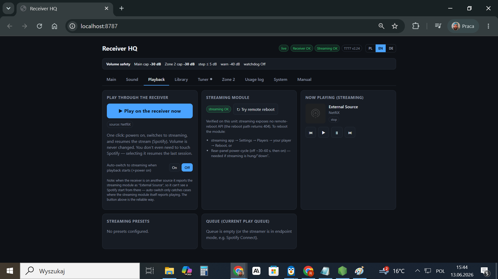
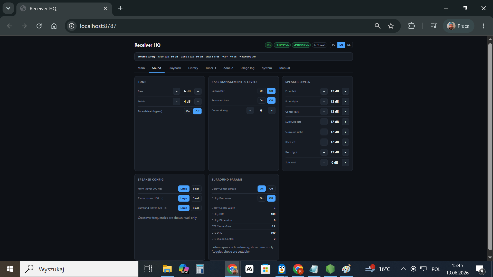
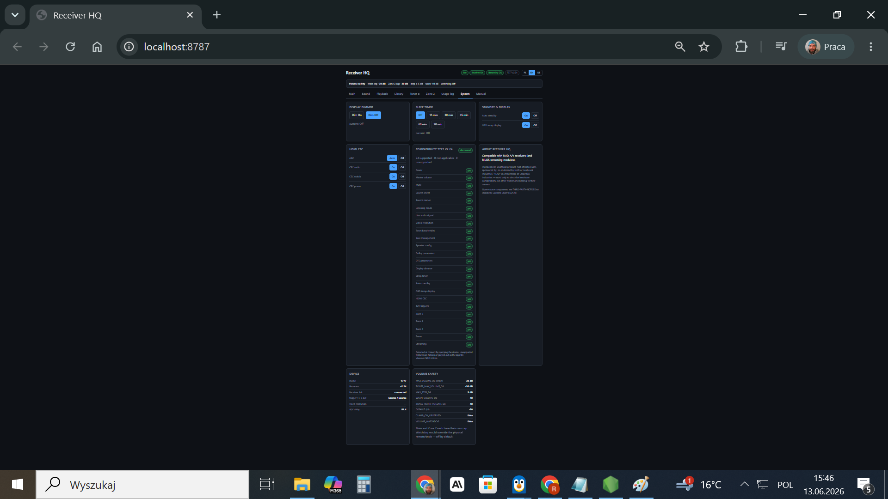

# Receiver HQ — lokalny panel sterowania amplitunerem A/V (NAD T 777)

Lokalna aplikacja webowa do sterowania i monitoringu amplitunera kina domowego NAD
T 777. Komunikuje się bezpośrednio z urządzeniem w sieci LAN (protokół NAD V2.x po
TCP oraz moduł streamujący BO po HTTP) — **bez chmury, bez kont, bez zależności od zewnętrznych
usług**. Sercem projektu jest *server-side volume guard*: warstwa bezpieczeństwa,
która gwarantuje, że oprogramowanie nigdy nie przekroczy ustawionego limitu
głośności ani nie podniesie jej samo z siebie — istotne, bo aplikacja steruje
realnym wzmacniaczem mocy i głośnikami.

> Niezależny, nieoficjalny projekt. Niepowiązany z NAD ani Lenbrook Industries.
> Nazwy „NAD", „Dirac" użyte wyłącznie opisowo (kompatybilność sprzętowa).

## Zrzuty ekranu

| Główne — wyświetlacz VFD | Odtwarzanie (BO) |
|---|---|
|  |  |

| Dźwięk | System |
|---|---|
|  |  |

## Dlaczego ten projekt jest ciekawy inżyniersko

- **Bezpieczeństwo jako kontrakt, nie konwencja.** Dwie twarde gwarancje wymuszone
  po stronie serwera i niemożliwe do obejścia z UI:
  - **G1 — nigdy powyżej limitu:** każdy zapis głośności jest przycinany do
    `MAX_VOLUME_DB`; kroki względne liczone od stanu bieżącego i też przycinane.
  - **G2 — nigdy nie podnosi głośności samo:** żadne zdarzenie (start, reconnect,
    zmiana źródła, start odtwarzania) nie ustawia głośności.
  - Dodatkowo: limit pojedynczego kroku (`MAX_STEP_DB`), rate-limiting komend,
    próg ostrzegawczy z wymuszonym potwierdzeniem, brak cichych domyślnych —
    backend **odmawia startu bez `MAX_VOLUME_DB`**. Logika w czystej, przetestowanej
    funkcji (`apps/api/src/volume/guard.ts` + testy jednostkowe).
- **Reverse-engineering protokołu sprzętowego.** Własny klient NAD V2.x ASCII (TCP:23)
  i klient modułu streamującego BO (HTTP:11000, parsowanie XML), z fazą „discovery" odpytującą realne
  urządzenie i wykrywaniem dostępnych funkcji (`capabilities.ts`) — różne generacje
  firmware mają różne możliwości.
- **Świadomy model zagrożeń.** API steruje wzmacniaczem, więc domyślnie nasłuchuje
  **tylko na loopbacku** (`127.0.0.1`) i stosuje allowlistę nagłówka `Host`, co blokuje
  dostęp z LAN oraz ataki DNS-rebinding ze stron WWW. Wyjście na LAN to świadomy
  opt-in (`ALLOW_LAN=1`, zalecany token).
- **Jeden allowlistowany kanał zapisu ustawień**, który **twardo odrzuca każdy klucz
  zawierający „Volume"** — dzięki czemu nie da się obejść volume guard inną drogą.

## Kluczowe funkcje

- **Wyświetlacz VFD** — wierne odwzorowanie przedniego panelu NAD T 777 (źródło,
  głośność, tytuł now-playing, tryb odsłuchu + linia sygnału na żywo).
- **Sterowanie** zasilaniem, źródłem (1–12 z nazwami z urządzenia), wyciszeniem,
  trybem odsłuchu; karta **Signal / jakość** z dekodowania odbiornika (codec,
  liczba kanałów, sample rate, lock) wzbogacona o dane z modułu streamującego BO.
- **Guarded volume** — suwak ograniczony do limitu, dochodzenie do celu rampą
  kroków ≤ `MAX_STEP_DB`, każdy jako osobna strzeżona komenda.
- **Now Playing (BO)** — transport, presety, opcjonalny *auto-switch*: gdy ruszy
  odtwarzanie (np. Spotify), aplikacja włącza odbiornik i przełącza źródło na BO —
  **nigdy nie zmieniając głośności** (G2).
- **Tuner** (FM/AM, strojenie, presety), **Dźwięk** (tony, bass management, poziomy
  8 głośników, konfiguracja kolumn, parametry surround), **Strefa 2** z własnym capem.
- **Biblioteka BO** z nawigacją i odtwarzaniem jednym dotknięciem oraz eksportem
  „listy utworów" (tylko tytuły/wykonawcy — **nigdy audio**) do CSV.
- **Log użycia** — co grało, jak długo i jak głośno; segmenty liczone z pollingu,
  trwale zapisywane do pliku JSONL.
- **Panel systemowy** — dimmer, sleep timer, auto-standby, HDMI-CEC/ARC, informacje
  o urządzeniu, podgląd ustawień bezpieczeństwa głośności.

## Stack technologiczny

| Warstwa | Technologie |
|---|---|
| Monorepo | pnpm workspaces, Node ≥ 22, TypeScript 5.7, ESLint 10 |
| Backend (`apps/api`) | Fastify 5, `@fastify/websocket`, `@fastify/cors`, Zod, `fast-xml-parser`; własne klienty TCP (NAD) i HTTP (moduł streamujący BO) |
| Frontend (`apps/web`) | React 18, Vite 6, własne i18n (PL) |
| Testy | Vitest (logika volume guard + bezpieczeństwo) |
| Dystrybucja | portable `.exe` (`@yao-pkg/pkg` + esbuild), web osadzony w binarce |
| CI | GitHub Actions |

## Architektura

```
apps/api
  scripts/probe.ts        discovery — odpytanie urządzenia (read-only)
  src/config.ts           walidacja env (odmawia startu bez MAX_VOLUME_DB)
  src/volume/guard.ts     czysta logika clamp/step/relative  ← krytyczne dla bezpieczeństwa
  src/volume/service.ts   jedyna ścieżka ustawiająca głośność
  src/nad/client.ts       klient NAD V2.x (TCP:23)
  src/nad/capabilities.ts wykrywanie funkcji per firmware
  src/stream/client.ts    klient modułu BO (HTTP:11000)
  src/state.ts            polling + stan + alert/watchdog over-cap
  src/server.ts           trasy Fastify + WebSocket
apps/web                  interfejs React + Vite (zakładkowe menu)
```

## Uruchomienie

Wymagania: Node ≥ 22, pnpm, amplituner NAD osiągalny w LAN.

```bash
pnpm install

# 1) Konfiguracja
cp .env.example .env
# uzupełnij DEVICE_IP oraz wymagane MAX_VOLUME_DB

# 2) (opcjonalnie) discovery — read-only sprawdzenie urządzenia
DEVICE_IP=192.168.1.2 pnpm probe

# 3) Backend (czyta .env z roota repo) → http://localhost:8787
pnpm --filter @receiver-hq/api dev

# 4) Frontend (proxy /api i /ws do backendu) → http://localhost:5173
pnpm --filter @receiver-hq/web dev
```

Otwórz http://localhost:5173.

### Minimalna konfiguracja (`.env` w katalogu głównym)

```env
DEVICE_IP=192.168.1.2
MAX_VOLUME_DB=-30        # wymagane; twardy limit (głośniej = wyższe dB)
MAX_STEP_DB=5
WARN_VOLUME_DB=-40
HTTP_PORT=8787
# ALLOW_LAN=1            # świadomy opt-in na dostęp z LAN (zalecany token)
```

## Testy i kontrola jakości

```bash
pnpm --filter @receiver-hq/api test    # testy jednostkowe volume guard + security
pnpm typecheck                          # typecheck api + web
pnpm lint
```

## Licencja

MIT. Patrz `EULA.txt`, `DISCLAIMER.txt`, `PRIVACY.md`, `THIRD-PARTY-NOTICES.txt`.
